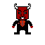
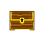

############
Characters
############

.. TODO: A karakterek attribútumait összegyűjteni!

Attribútumok
------------

**Élet attribútum**

Az élet attribútum arra szolgál hogy, a felhasználó számára megjelenítse mennyi sebzést tud még elviselni, mielőtt meghal.
Ez az attribútum a játékban úgy néz ki hogy, van egy elem amiben vannak töltések.
Minden töltés két részből áll, amint sebzés éri a játékost, az töltés kettéhasad és a fele marad meg.
Kezdetben három egész töltéssel kezd a játékos, ami később növelhető upgrade-ek vásárlásával.
Az ellenfeleknek is van élet attribútuma és itt is ugyanígy működik.
    

**Állóképesség/kitartás(Stamina) attribútum**

.. image:: ./Stamina.png

Néhány képesség mint például a sprintelés és a "dash" használata Állóképesség erőforrást használ, így amikor igénybe veszi a játékos ezeket, csökken az Állóképessége.
Ez az attribútum regenerálódik, amint a játékos nem használ ilyen erőforrást igényő képességet.
Itt is hasonlóan az élet attribútumhoz, kezdetben 3 töltéssel kell gazdálkodnia a játékosnak.

**Mana attribútum**

Ezt az erőforrást a játékos haláltípushoz kapcsolódó képességekkel veszi igénybe.
Minden képesség támadáshoz fél manatöltést használ. A manatöltések regenrálódnak abban az esetben, ha a játékos nem használ manát igénybevevő képességet.
Itt is mint az Élet és Állóképesség attribútumok is növelhetők ugrade-ek vásárlásával.
A mana töltések száma három darab.

**Gold**

.. image:: ./gold.png

Az aranynak a játékban fontos szerepe van mivel, ezt felhasználva vásárolhat a játékos az ördög npc-től upgrade-eket.
Lehetősége van a játékosnak, képesség, attribútum növelő fejlesztések vásárlására.
Aranyat a játékos a legyőzött ellenségektől és küldetések teljesítésével szerezhet.

**Key**

.. image:: ./ajto.gif

A játékosnak az előrehaladás érdekében kulcsokat kell gyűjteni, speciális ajtók és ládák kinyitásához.
Kulcsokból négy féle változat létezik: piros, kék, zöld, sárga.
Néhány ajtóhoz több különböző színű kulcs szükséges, hogy az ajtót ki lehessen nyitni.
A kulcsok a pályán meghatározott helyen, el vannak rejtve, amiket a játékosnak meg kell találnia.
A játékos egy színből egy kulcsot tárolhat, így összesen négy különböző színű kulcsot tarthat magánál, amiket később felhasználhat ajtók kinyitásához.

.. TODO: Karakter típusok, hierarchiák, ...
Egy fő karakter típus lesz, haláltól függően a karakternek megváltozik a kinézete és a képessége.
Ellenfélből két féle lesz: egy közelharci és egy távharcos.(lövöldöz ránk)

**Karakter típusok**

A főhős:
---------

A játék során ő az egyetlen irányítható karakter. Közelharci támadása bármilyen haláltípusnál használható, ami nem igényel manát.
A közelharci támadáshoz legalább 1 block közel kell állnia a játékosnak az ellenféltől.
Közelharci támadást minden haláltípus karakterrel végre lehet hajtani.

Attribútumai:

* Sebzés: nincs, mivel ő emberként nem támadhat

* Élet: 3 töltés(6)

* Állóképesség: 3 töltés(6)

* Mana: 3 töltés(6)

* Mozgási sebesség: 200(Max)

* Karakter inventory: arany(helyi fizetőeszköz), kulcsok (maximum 4 db különböző színű kulcs lehet nála)

A különböző halálképességeinek sebzése 1.5 töltés(kezdetben, ez később fejleszthető), ezeknek használata 1 manatöltés.
A képességeket 2 másodperc lehülési idő elteltével használhatja.

Főhős halálképességei:
----------------------

A halálképességek beáltakor, ugyanazzal az élet/Állóképesség/mana attribútum mennyiséggel osztoznak a különböző karakterek.

**Repülő halálképesség**

A főhőst, ha magas zuhánás általi halál éri, ez a haláltípus áll be nála.
Passzív képességének tekinthető hogy tud repülni és emiatt többé képtelen meghalni árokba zuhanástól.

Speciális képességéhez a karmait használja amit mélyen az ellenfélbe mélyeszt, ennek a képességnek az ára 1 manatöltés.
Miután használta a képességet, jelentkezni fog egy lehülési idő ami 2 másodperc, ezt követően tudja újra használni a képességet, abban az esetben ha van elegendő manája.

* A képesség sebzése: 2 töltés

* Mozgási sebesség: 300(Max)

**Tűz halálképesség**

Abban az esetben veheti fel a játékos, ezt a képességet hogyha tűz általi halált hal.
Ezt robbanó hordók, Lángszórós rosszfiú karakter tudja előidézni.
Ekkor a játékos egy láng démonná alakul, és emiatt többet nem sebezheti a tűz/robbanás.

Speciális képessége, hogy egy tűzgolyót lő az ellensége felé.
A képesség használata után 2 másodperc lehülési idő, lép életbe.

* A képesség sebzése: 1.5 töltés

* Mozgási sebesség: 200(Max)

**Vas halálképesség**

A játékost hogyha a gépfegyveres kolléga, túl sokszor eltalálja és meghal.
Főhősünk ezzel a halálképességgel fog újraéledni.

Speciális képessége, hogy hosszú karjait használva egy erőütést hajt végre.
A képesség használata után 2 másodperc lehülési idő, lép életbe.

* A képesség sebzése: 2.5 töltés

* Mozgási sebesség: 120(Max)

A gépfegyveres kolléga:
----------------------

Ellenséges npc, általában őrt áll valahol és figyel a behatolókra.
Észreveszi és megtámadja a főhőst, amint az 15 block közel helyezkedik el tőle és nincs takarásban.

Attribútumai:

* Élet: 2 töltés(4)

* Mana: nincs

* Állóképesség: 3 töltés (6) 

Amikor támad a játékosra, és az túl közel kerül, megpróbál elmenekülni és távolról újra felvenni vele a harcot.
(megpróbál 10 block távolságra lenni tőle és újra tüzel)
Mozgási sebesség: 250(Max)

Lángszórós rosszfiú:
-------------------

Ellenséges npc, amint észreveszi a főhőst, megpróbál közel kerülni hozzá és a lángszórójával elégetni.
(3-5 block közel kell kerüljön a főhős karakterhez hogy támadni tudjon)

Attribútumai:

* Élet: 4 töltés(8)

* Mana: nincs

* Állóképesség: 2 töltés(4)

A játékos felhasználót 15 block távolságról kiszúrja, és ha nincs takarásban, elindul felé hogy támadjon.
Mozgási sebesség: 150(Max)

Ördög
-----

Semleges npc, a főhős főnöke...
A játékos tőle tud vásárolni fejlesztéseket a speciális képességeihez, illetve passzív upgrade-eket is vehet mint például Élet, Mana, Állóképesség növelés.
A főhős, az "E" interakció gombbal tud vele kommunkálni.
Gyakori monológja hogy: "Everything has a price..."

.. TODO: Skill tree és hasonlók, fejlődési lehetőségek

**Skill fa és fejlődési lehetőségek**

.. image:: ./skilltree.png
    :width: 128px
    :height: 128px

A játék során ahogy halad előre a főhős, újabb és újabb képességekre tesz majd szert azáltal hogy különböző tragikus halálokat hal.
Amitől a főhős meghalt, újraéledése után immunis lesz. Így ha éppen felgyújtották, és elégett, újraéledését követően nem okozhatja halálát a tűz sebzése.
A játékban négy alap haláltípus létezik, amelyekhez egyedi tamádási képességek is tartoznak.
Minden haláltípushoz egyedi skill-fa társul. A képességek fejlesztésére van lehetősége a játékosnak, amit meghatározott mennyiségű arannyal vásárolhat az ördögtől.
A fejlesztések vásárlásával a képességek kevesebb manát használnak illetve nagyobb sebzést tesz lehetővé, ami az előrehaladást igencsak megkönnyíti.

.. TODO: Megjelenítéssel, előnyökkel/hátrányokkal kapcsolatos leírások.

