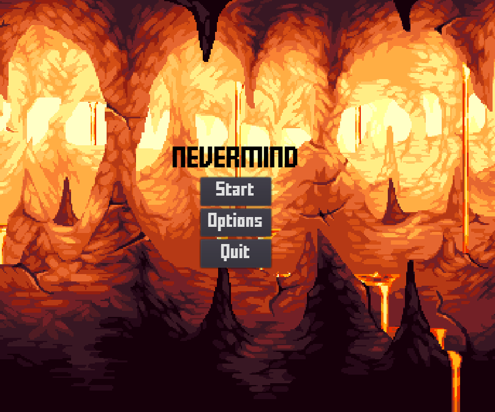
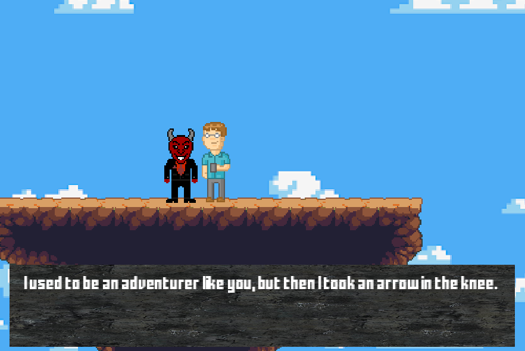

Controls
========
.. |br| raw:: html
    
Billentyű és egér kezelés
-------------------------

.. TODO: Billentyűzet, egér vagy bármilyen egyéb kontroller szerepét átgondolni, és részletezni.

.. list-table:: Karakter mozgása
   :align: left
   :widths: 5 10

   * - .. image:: ./w.png
           :height: 35
           :width: 35
           :align: center 
     - Ugrás.
   * - .. image:: ./d.png
           :height: 35
           :width: 35
           :align: center
     - A karakter jobbra halad.
   * - .. image:: ./a.png
            :height: 35
            :width: 35
            :align: center
     - Guggolás
   * - .. image:: ./s.png
            :height: 35
            :width: 35
            :align: center
     - A karakter balra halad 
   * - .. image:: ./space.png
            :height: 35
            :width: 100
            :align: center

     - A karakter végrehajt egy dash abba az irányba, amerre éppen néz.

   * - .. image:: ./e.png
         :height: 35
         :width: 35
         :align: center

     - Interakció gomb 

Interackióra szükségünk van:

* Ajtók kinyitásához

* Ládák kinyitásához

* Semleges npc-kel való kommunikáláshoz

* Lift kezeléséhez

* Párbeszédek átugrásához

Egérrel navigálhatunk a menü-ben, illetve az Ördög boltjában is.

.. list-table::
   :widths: 10 50
   :align: left

   * - .. image:: ./left.png
                :height: 50
                :width: 35
                :align: center
     - Bögrét dobást hajhatunk végre, az egérkurzor irányába.
   * - .. image:: ./right.png
                :height: 50
                :width: 35
                :align: center
     - Jobb egérgomb - Speciális képesség használata

Grafikus elemek
---------------

.. TODO: Menük, gombok és egyéb interaktív elemek működése, megjelenítésükkel kapcsolatos ötletek.

A játék indításakor a főmenüben találjuk magunkat, ahol navigálhatunk a hogy éppen mit szeretnénk végrehajtani.
Főmenüből elérhető:

* Játék indítása - Elindíjta a legutolsó játékot, az aktuális állapottal.

* Beállítások -  beállítások menüpontban lehetőségünk van a billentyűzet kiosztás átállítására, felbontás, hang erősség beállítására.

* Mentések betöltésére - itt előző játékok lementett állapotaitól folytathatjuk a játékot.

A játékban beszélgethetünk semleges karakterekkel, ezek közül fontosabb kiemelést érdemel az Ördög karakter.

Nála vásárolhat a főhős, Speciális képességeihez fejlesztéseket, illetve passzív attribútum növelésre is van lehetősége, meghatározott mennyiségű aranyért cserébe.
Itt menü rendszerben jelenik meg a vásárlás, ahol az egérrel vagy a nyilakkal navigálhat a felhasználó.
Amint a játékos kijelöl valamit a várárlás menüben, annak megjelenik a hozzá tartozó ára.
Ezt követően a játékostól kér egy megerősítést hogy biztosan meg szeretné-e venni azt a fejlesztést, és ha elfogadta a játékos, a fejlesztés aktiválódik.
A fejlesztéseket csak az Ördög karakternél várásolhatja meg a játékos.
