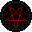
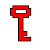
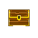
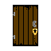

Inventories
===========

.. TODO: Milyen tárgyak vannak?

**Inventory**

A főhős karakternek inventoryja, kulcsok és arany tárolására alkalmas.
Kulcsokból négy féle szín van, a kulcsok mindig a saját színükhöz megfelelő zárakat tudnak kinyitni.
A játékos egy féle kulcsból egyszerre egyet tud magával hordozni, ezáltal maximum négy darab kulcsot vihet magával.

.. TODO: Mennyi tárgy lehet egyszerre egy karakternél?

**Kulcsok**

A kulcsoknak fontos szerepük van az előrejutással kapcsolatban, mivel számos fontos ajtó kinyitásához szüksége lesz a játékosnak kulcsokra.
Kulcsokat a játékos találhat például az ellenségeknél, illetve titkos ládákban.
A kulcsok ténylegesen megjelennek a karakter oldalán, így láthatja a játékos könnyen hogy mégis milyen kulcsai vannak.

.. TODO: A megjelenítésnél milyen szerepe van? (Pl. fegyverek, pajzs, öltözet, ...)
.. TODO: Hogyan hat ki a karakter mozgására?

Ha a játékos több kulcsot hord magánál, azok hangot adnak ki ami felriaszthatja a közeli őröket.
pro tipp: érdemes lehet később összeszedni a kulcsokat, miután az ellenségeket a játékos legyőzte.

**Arany**

Az arany, itt a pénznem amivel a játékos az ördögtől tud vásárolni upgrade-eket a képességeihez.
Ezáltal több lehet a mana, élet, állóképesség töltéseinek a száma, és a halálképességeihez tartozó képesség fát is itt tudja kialakítani.
Aranyat a játékos a legyőzött ellenfeleinél találhat, illetve elrejtett ládákban.

.. TODO: Mennyi tárgy lehet egyszerre egy karakternél?

A játékos bármennyi aranyat tarthat magánál, nincs rá korlátozás.
