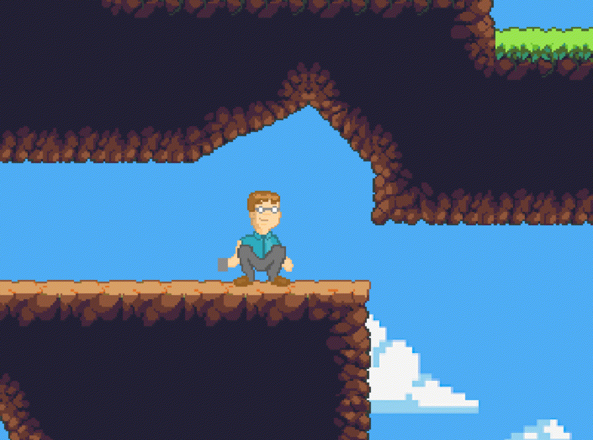
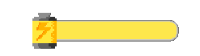
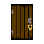

Mechanics
=========

Ütközések kezelése
------------------

.. TODO: Leírni, hogy hogy tudnak például egymás mellett elmenni a karakterek.
**NPC**

Barátságos npc-k előtt elsétálhatunk, ebben az esetben nincs kollózió bekapcsolva.
Barátságos npc például az Ördög (lásd karakterek menüpont)

.. image:: ./devilseta.gif

Ellenséges npc-ken, nem tudunk keresztül menni
Emiatt muszáj átugranunk vagy másik utat választanunk hogyha el szeretnénk menni melletük.

**Ládák**

Kinyitható ládákon szintén át tudunk haladni, a láda kinyitása az "E" interakció gomb segítségével nyitható ki.
Ekkor a láda tartalmát kiírja a játék, és a játékos inventory-jába kerül.

.. image:: ./chestseta.gif

Harcrendszer
------------

.. TODO: Milyen sebzési típusok vannak? Fegyverek? Sebzésszámítás? Mágia?

A főhősnek van egy semmilyen erőforrást nem igénylő közelharci támadása, ez viszont közel sem sebez annyit mint a speciális képességei.
A közelharci támadáshoz a karakterünknek legalább 1 block közel kell kerüljön az ellenséges npc-hez, hogy eltalálja.
A programozó karakternek speciális képessége a bögre hajítás, aminek nem szabad lebecsülni az erejét.
Karakterünk emellett kihasználhatja a gyors mozgásképességét is mivel képes a karakter dash alkalmazására.

**Dash**

A dash-t tudjuk alkalmazni guggolás közben is, így újabb területekre is el tudunk jutni.

**Slide**

Az ellenséges npc-k is megpróbálnak a számukra megfelelő támadási távolsághoz kerülni.
Ez pontosan A gépfegyveres kolléga esetén 10 block távolság.

.. image:: ./enemy.gif

Amíg a Lángszórós rosszfiú esetén ez 3 block. Ez az a távolság ami elég az ellenséges npc-knek ahoz hogy ténylegesen eltalálja a támadása a főhősünket.

.. image:: ./enemyfire.gif

Főhősünknek vannak speciális halálképességei ami manát igényelnek, de a sebzése igencsak több mint a közelharci támadás.

A karakter speciális támadásai közül:

**légi halálképesség**: 2 block távolságra van szükség, annak érdekében hogy el tudja találni az ellenfelet.

**tűz halálképesség**: 8 block távolságra van szükségünk, mivel ez egy távolharci képesség.

**vas halálképesség**: 4 block távolságra van szükség, hogy sikeresen eltaláljuk az ellenfelet.

Erőforrások kezelése
--------------------
.. TODO: Arany, manna, bármi egyéb, ...
.. image:: ./gold.png
   :align: left

**Arany**

Az arany, itt a pénznem amivel a játékos az ördögtől tud vásárolni upgrade-eket a képességeihez.
Ezáltal több lehet a mana, élet, állóképesség töltéseinek a száma, és a halálképességeihez tartozó képesség fát is itt tudja kialakítani.
Aranyat a játékos a legyőzött ellenfeleinél találhat, illetve elrejtett ládákban.
A játékos bármennyi aranyat tarthat magánál, nincs rá korlátozás.

**Key**

.. list-table::
   :align: left

   * - .. image:: ./programmerkulcs.gif
 
     - .. image:: ./keyblue.png
               :align: center
               :scale: 200 %
     - .. image:: ./keyred.png
             :scale: 200 %
             :align: center

     - .. image:: ./yellowkey.png
             :scale: 200 %
             :align: center

     - .. image:: ./greenkey.png
             :scale: 200 %
             :align: center
     - .. image:: ./lada.gif
             :align: center
     - .. image:: ./ajto.gif
             :align: center

A játékosnak az előrehaladás érdekében kulcsokat kell gyűjteni, speciális ajtók és ládák kinyitásához.
Kulcsokból négy féle változat létezik: piros, kék, zöld, sárga.
Néhány ajtóhoz több különböző színű kulcs szükséges, hogy az ajtót ki lehessen nyitni.
A kulcsok a pályán meghatározott helyen, el vannak rejtve, amiket a játékosnak meg kell találnia.
A játékos egy színből egy kulcsot tárolhat, így összesen négy különböző színű kulcsot tarthat magánál, amiket később felhasználhat ajtók kinyitásához.

**Élet attribútum**

.. image:: ./heart.png

Az élet attribútum arra szolgál hogy, a felhasználó számára megjelenítse mennyi sebzést tud még elviselni, mielőtt meghal.
Ez az attribútum a játékban úgy néz ki hogy, van egy elem amiben vannak töltések.
Minden töltés két részből áll, amint sebzés éri a játékost, az töltés kettéhasad és a fele marad meg.
Kezdetben három egész töltéssel kezd a játékos, ami később növelhető upgrade-ek vásárlásával.
Az ellenfeleknek is van élet attribútuma és itt is ugyanígy működik.
    

**Állóképesség/kitartás(Stamina) attribútum**

Néhány képesség mint például a sprintelés és a "dash" használata Állóképesség erőforrást használ, így amikor igénybe veszi a játékos ezeket, csökken az Állóképessége.
Ez az attribútum regenerálódik, amint a játékos nem használ ilyen erőforrást igényő képességet.
Itt is hasonlóan az élet attribútumhoz, kezdetben 3 töltéssel kell gazdálkodnia a játékosnak.

**Mana attribútum**

.. image:: ./Mana.png

Ezt az erőforrást a játékos haláltípushoz kapcsolódó képességekkel veszi igénybe.
Minden képesség támadáshoz fél manatöltést használ. A manatöltések regenrálódnak abban az esetben, ha a játékos nem használ manát igénybevevő képességet.
Itt is mint az Élet és Állóképesség attribútumok is növelhetők ugrade-ek vásárlásával.
A mana töltések száma három darab.

Világgal való interakció
------------------------

.. TODO: Kapuk működése, akadályok, csapdák, ...

A játékban nagy szerepük van a nyitható ajtóknak, ezeken csak akkor tud áthaladni a játékos, hogyha megszerezte hozzá a megfelelő színű kulcsot.
Kulcsokból a játékban négy alapszín van.(Lásd Erőforrások)

.. list-table::
   :align: left

     - .. image:: ./keyblue.png
               :align: center
               :scale: 200 %
     - .. image:: ./keyred.png
             :scale: 200 %
             :align: center

     - .. image:: ./yellowkey.png
             :scale: 200 %
             :align: center

     - .. image:: ./greenkey.png
             :scale: 200 %
             :align: center
     - .. image:: ./lada.gif
             :align: center
     - .. image:: ./ajto.gif
             :align: center

A játékos lezárt ajtókkal is találkozhat, ezekhez szüksége lesz megfelelő színű kulcsra.
Amint a megfelelő kulccsal az ajtóhoz áll a főhős, és megnyomja az "E" interakció gombot, az ajtó kinyílik és áthaladhat!

**Ajtók**

A játékos lezárt ajtókkal is találkozhat, ezeken való áthaladáshoz, a játékosnak szüksége lesz megfelelő színű kulcsokra.
Amint a megfelelő kulccsal az ajtóhoz áll a főhős, és megnyomja az "E" interakció gombot, az ajtó kinyílik és áthaladhat!
Ekkor a kulcs elveszlik, de az ajtó továbbra is nyitvamarad későbbi használatokra.

**Portálok**

A szabadon felfedezhető világban előfordulhatnak portálok is.
Ezek nem igényelnek kulcsot, és bármi más erőforrást, viszont nem tudhatja a játékos a portál éppen hová fogja átvinni.
Mielőtt áthaladna a játékos a portálon, muszáj meggondolja azt, hogy megéri-e a kockázat. 
Lehetséges hogy a portál másik oldalán, kellemetlen fogadtatás várja majd.

A főhősnek számos csapdát is el kell kerülnie, mivel találkozhat kaladja során:

#. Szakadékba vagy tűzbe vezető csapóajtókkal.
#. Robbanó hordókkal.
#. Félelmetes szakadékokkal.

A robbanó hordók esetén, nem elég a játékosnak nem megsebezni őket, hanem figyelnie kell hogy az ellenséges npc-k ne tegyék meg.
Mivel amint a hordót sebzés éri, felrobban és a hatótávolságán belül mindenkit sebzés ér és meggyulladnak a karakterek.
(A robbantás hatótávolsága 5 block)
